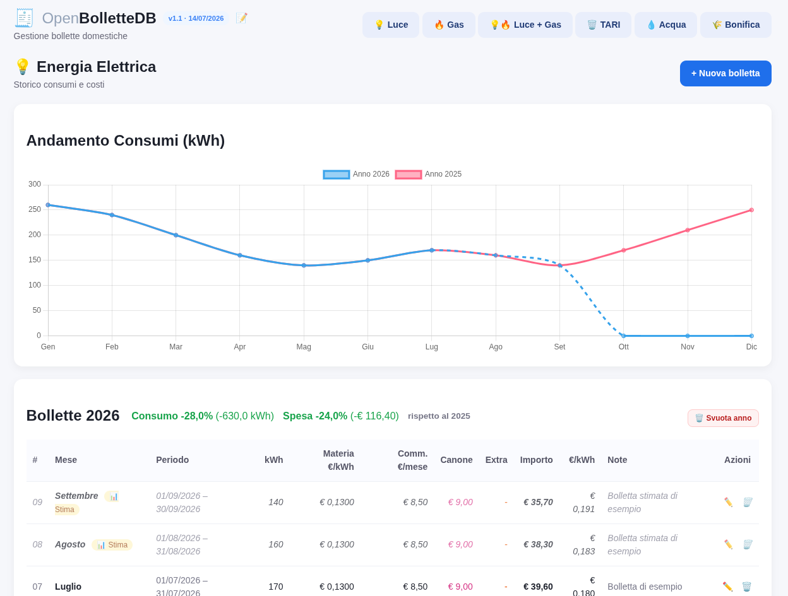
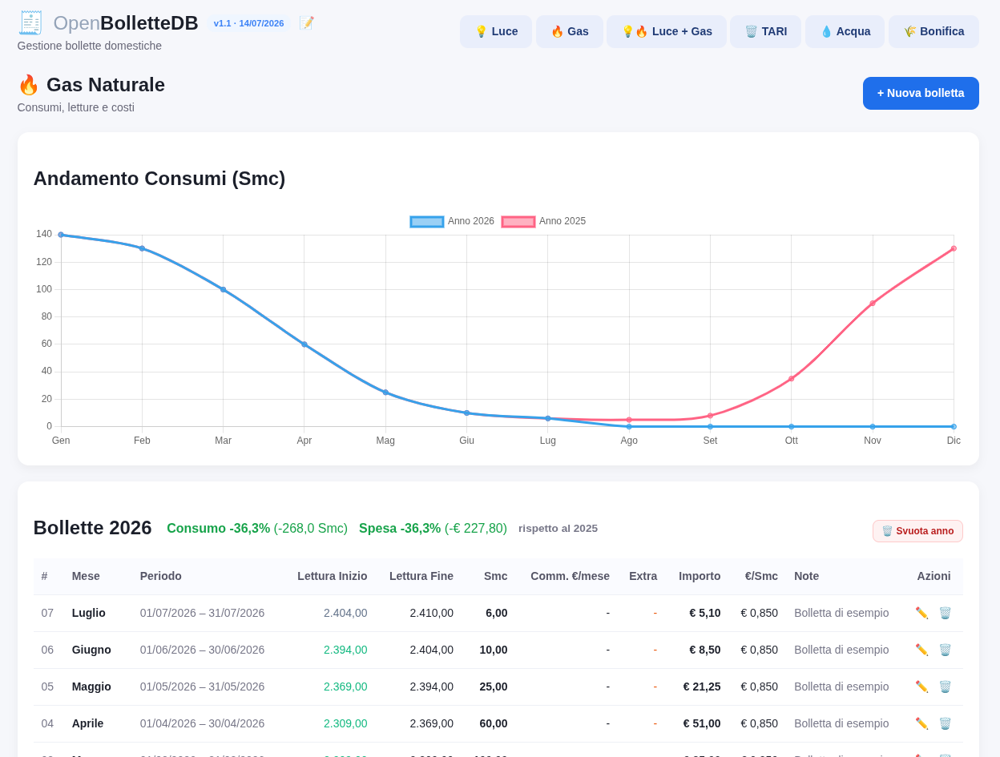
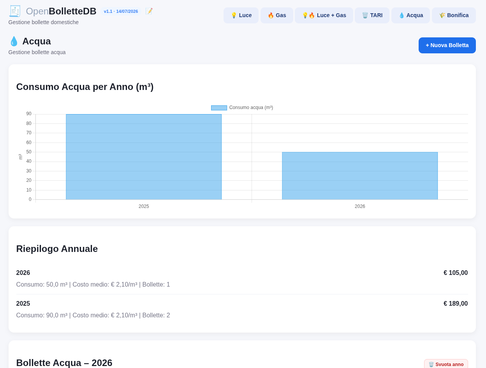
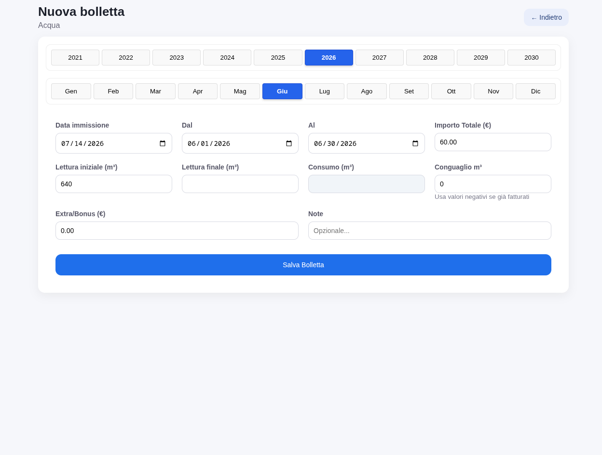

# OpenBolletteDB

[Italiano](README.md) | **English**


[](LICENSE)

A small PHP application with no framework or package manager, for tracking household electricity, gas, water, waste tax
(TARI), and land-reclamation consortium bills in a local SQLite database.

## Features

- Separate dashboards for **Electricity**, **Gas**, **Electricity + Gas**, **Water**, **TARI**, and
  **Land-reclamation consortium** charges.
- Create, edit, and delete bills, grouped by year, including records dated before 2021.
- Consumption and cost charts, yearly summaries, year-over-year comparisons, and monthly averages
  based on the months that actually contain data.
- Extra charges, credits, and adjustments; estimated-bill support for Electricity and Water.
- **Water** dashboard with start/end meter readings, manual reading history, daily average, price per
  cubic metre, and separate reported/estimated consumption, adjustment, and billed quantity.
- Water self-reading window displayed in the table; future dates are automatically highlighted in
  red with a reminder bell.
- **Electricity + Gas** chart shows every available year, including years containing only one utility.
- **TARI** fields for notice type and number, billing period, invoice date, and recycling percentage.
- **Land-reclamation consortium** notices with due date, payment date, and late/unpaid warnings.
- Multiple accounts with **Administrator** and **Read-only** roles, profile management, and automatic
  session revocation after sensitive account changes.
- Responsive interface, software version on the login page, built-in release notes, optional demo
  data, and protected per-utility/year cleanup tools.

## Screenshots

The screenshots use fictional records generated by `app/seed_demo.php`; they do not contain real user
bills.

| Electricity | Gas |
|---|---|
|  |  |

| Water | New bill |
|---|---|
|  |  |

## Requirements

- PHP 8.x with PDO SQLite
- Apache/php-fpm or another PHP-capable web server

The application is currently tested on **Fedora 44** with Apache 2.4 and php-fpm 8.x. Other systems
should work, but package names, paths, permissions, and SELinux configuration may differ.

## Installation on Fedora 44

```bash
sudo dnf install -y httpd php-fpm php-pdo git
sudo systemctl enable --now httpd php-fpm
sudo firewall-cmd --permanent --add-service=http
sudo firewall-cmd --reload

cd /var/www/html
sudo git clone https://github.com/markhawks/openbollettedb.git OpenBolletteDB
cd OpenBolletteDB

sudo chgrp apache data
sudo chmod 770 data
sudo find data -maxdepth 1 -type f -name '*.sqlite*' -exec chmod 660 {} +

php app/migrate.php
php app/seed_demo.php  # optional fictional demo data
```

Open `http://<server-address>/OpenBolletteDB/`.

### SELinux

When SELinux is enforcing, allow Apache to write to `data/`:

```bash
sudo semanage fcontext -a -t httpd_sys_rw_content_t "/var/www/html/OpenBolletteDB/data(/.*)?"
sudo restorecon -Rv /var/www/html/OpenBolletteDB/data
```

### Protect internal directories with Apache

Fedora normally sets `AllowOverride None`, so the included `.htaccess` files may be ignored. Create
`/etc/httpd/conf.d/openbollettedb.conf`:

```apacheconf
<Directory "/var/www/html/OpenBolletteDB">
    Options -Indexes
</Directory>

<Directory "/var/www/html/OpenBolletteDB/data">
    Require all denied
</Directory>

<Directory "/var/www/html/OpenBolletteDB/app">
    Require all denied
</Directory>
```

Run `sudo apachectl configtest`, reload Apache, and confirm that `data/openbollettedb.sqlite` cannot be
downloaded through the browser.

## Quick development setup

```bash
php app/migrate.php
php app/seed_demo.php  # optional
php -S localhost:8000 -t .
```

Then open `http://localhost:8000/`. The demo seeder never changes a database that already contains
bills.

## Default account

- Username: `admin`
- Initial password: `admin2026`

Change the default password immediately from the user-management page.

## Security

- Every dashboard and write endpoint requires authentication.
- Administrators can write and manage users; Read-only accounts can only view dashboards.
- Every state-changing request uses POST and CSRF protection.
- Sessions expire after 30 minutes of inactivity and are revoked after password, role, or account
  changes.
- Login attempts are rate-limited: five failures block the username/IP pair for 15 minutes.
- Session cookies are HttpOnly, SameSite, and automatically Secure over HTTPS.
- Migration and demo-seeding scripts only run from the command line.
- Duplicate bills and duplicate metrics per bill are rejected.

This project is designed primarily for a local network. Use HTTPS and review the web-server
configuration before exposing it to the Internet.

## Project structure

- `index.php` — authenticated dashboard router
- `pages/dashboard_*.php` — utility dashboards
- `new_bill.php`, `edit_bill.php`, `delete_bill.php`, `reset_year.php` — bill management
- `login.php`, `logout.php`, `account.php` — authentication and user management
- `app/db.php` — shared PDO/SQLite connection
- `app/auth.php` — sessions, roles, revocation, and login throttling
- `app/csrf.php` — CSRF protection
- `app/validation.php` — central input validation
- `app/migrate.php` — database schema and migrations
- `app/seed_demo.php` — optional fictional demo records
- `changelog.php` — built-in release notes

See `CLAUDE.md` for internal architecture and data-model conventions.

## Backup

The SQLite database is stored in `data/openbollettedb.sqlite` and is excluded from Git. Before major
updates, checkpoint the WAL and create a copy:

```bash
php -r "
\$pdo = new PDO('sqlite:data/openbollettedb.sqlite');
\$pdo->exec('PRAGMA wal_checkpoint(TRUNCATE);');
copy('data/openbollettedb.sqlite', 'data/backup_' . date('Ymd_His') . '.sqlite');
"
```

Copy the resulting backup outside the web server and protect it appropriately.

## Known limitations

- Accounts share one household database; there is no per-account or per-property data isolation yet.
- Exact physical quarterly water consumption requires two consecutive real meter readings. The
  reported/estimated classification depends on the flag stored with each bill.
- There is no automated test suite yet.
- Deployment has only been tested on Fedora 44.

## Release notes

Use the 📝 icon in the application header, or open `changelog.php`.

## License

Copyright (c) 2026 maccu (onlymaccu@gmail.com).

OpenBolletteDB is free and open-source software licensed under the **GNU Affero General Public
License, version 3 or later** (`AGPL-3.0-or-later`). You may use, study, copy, and modify it. If you
distribute a modified version or make it available to users over a network, you must also make the
corresponding source code available under the same license. See [`LICENSE`](LICENSE).
